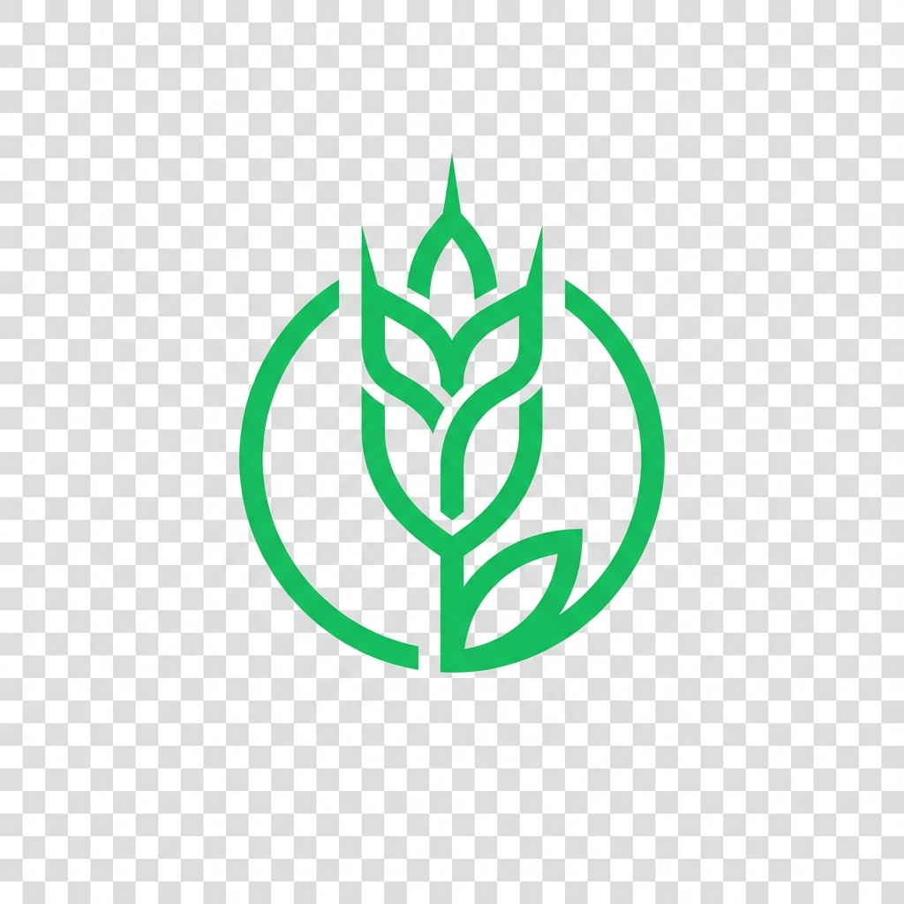
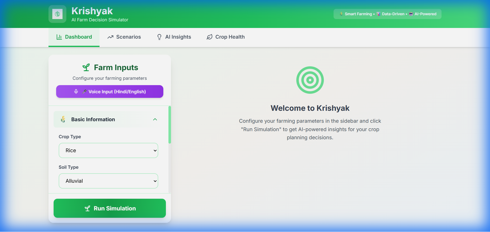
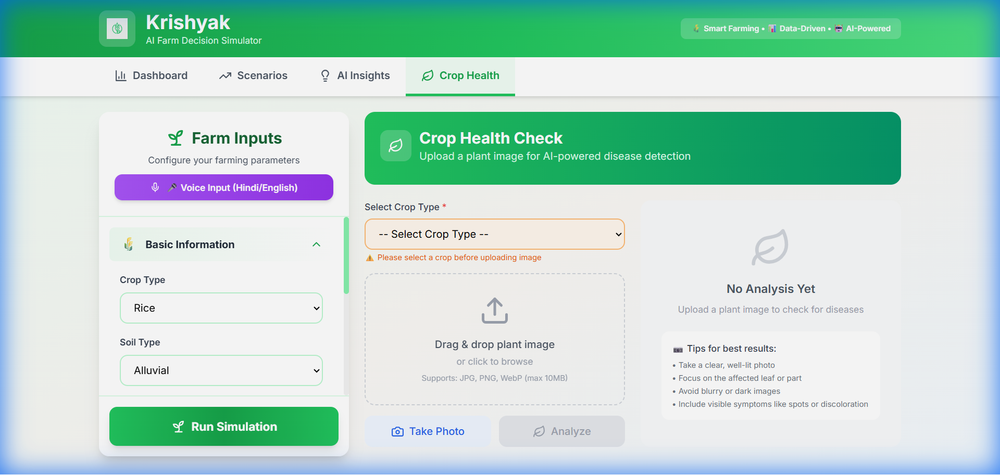
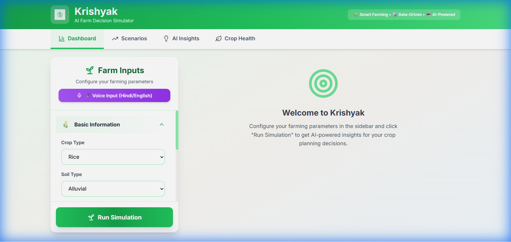

# Krishyak – AI Farm Decision Simulator 🌾

**Empowering Indian farmers with AI-powered decision support for optimal crop planning and profitability**

<p align="center">
  
</p>

## 📸 Screenshots

### Main Dashboard


### Crop Health Check (AI Disease Detection)


### Simulation Panel


---

## 🌾 Overview

Krishyak (कृष्यक - "The Cultivator") is a comprehensive full-stack web application that helps Indian farmers make data-driven decisions about crop planning, cultivation strategies, and market timing. The system uses advanced simulation engines, machine learning models, and real-time data to provide actionable insights.

## ✨ Key Features

| Feature | Description |
|---------|-------------|
| 🎯 **AI Yield Estimation** | Multi-factor yield prediction based on soil, rainfall, irrigation, fertilizer, and pest risks |
| 💰 **Cost Analysis** | Complete cultivation cost breakdown including seeds, fertilizers, labour, and logistics |
| ⚠️ **Risk Assessment** | Circular gauge with intelligent risk scoring (weather, price, pest, soil factors) |
| 📈 **Price Forecasting** | Time-series market price predictions with optimal selling recommendations |
| 🔄 **What-If Simulation** | Monte Carlo simulations (100-2000 scenarios) to compare farming strategies |
| 🤖 **Smart Recommendations** | Natural language insights for optimization opportunities |
| 🎤 **Voice Input** | Hindi & English voice commands - "दो हेक्टेयर धान की खेती" |
| 📍 **Location Auto-Fill** | Automatic soil type and rainfall detection via geolocation |
| 🏛️ **Government Schemes** | Eligibility checker for PM-KISAN, PMFBY, KCC and 8+ schemes |
| 🌿 **Disease Detection** | Multi-source AI-powered crop disease identification with treatment recommendations |
| 📱 **Mobile Responsive** | Floating action button and bottom sheet for mobile-first experience |

## 🏗️ Technology Stack

### Backend
- **Framework**: FastAPI (Python 3.8+)
- **ML/AI**: TensorFlow, Keras (MobileNetV2)
- **Simulation**: Monte Carlo engine, ARIMA-inspired forecasting

### Frontend
- **Framework**: React 18
- **Styling**: TailwindCSS
- **Charts**: Recharts
- **Voice**: Web Speech API

## 📁 Project Structure

```
krishyak/
├── backend/
│   ├── main.py                 # FastAPI application
│   ├── simulation_engine.py    # Monte Carlo simulator
│   ├── disease_detector.py     # Multi-source disease detection
│   ├── train_model.py          # ML model training pipeline
│   ├── model_inference.py      # Disease prediction
│   ├── config.py               # 50+ crops, MSP 2025 rates
│   └── requirements.txt
├── frontend/
│   ├── src/
│   │   ├── components/         # React components
│   │   ├── hooks/              # Custom hooks (voice, etc.)
│   │   ├── api/                # API clients
│   │   └── data/               # Static data (schemes, diseases)
│   └── package.json
└── screenshots/                # UI screenshots
```

## 🚀 Quick Start

### Prerequisites
- Python 3.8+
- Node.js 16+
- npm or yarn

### Backend Setup

```bash
cd backend
python -m venv venv
venv\Scripts\activate        # Windows
# source venv/bin/activate   # Linux/Mac
pip install -r requirements.txt
python main.py
```
- API: `http://localhost:8000`
- Docs: `http://localhost:8000/docs`

### Frontend Setup

```bash
cd frontend
npm install
npm start
```
- App: `http://localhost:3000`

### Environment Variables (Optional)

```bash
# backend/.env
OPENWEATHER_API_KEY=your_key_here
```

## 📡 API Endpoints

| Endpoint | Method | Description |
|----------|--------|-------------|
| `/simulate` | POST | Run farming simulation |
| `/forecast_prices` | POST | Forecast commodity prices |
| `/compare_scenarios` | POST | Compare farming strategies |
| `/recommend` | POST | Get AI recommendations |
| `/detect_disease` | POST | AI disease detection from image |
| `/crops` | GET | List of 50+ supported crops |
| `/soils` | GET | List of soil types |
| `/diseases` | GET | Disease database |

## 🌾 Supported Crops (50+)

- **Cereals**: Rice, Wheat, Maize, Barley, Bajra, Jowar, Ragi
- **Pulses**: Tur, Gram, Urad, Moong, Lentil, Chickpea
- **Vegetables**: Potato, Onion, Tomato, Brinjal, Cabbage, Cauliflower, Okra, Carrot, Spinach, Chilli
- **Fruits**: Mango, Banana, Grapes, Pomegranate, Orange, Guava, Papaya, Apple, Watermelon
- **Oilseeds**: Groundnut, Soybean, Sunflower, Mustard, Cotton, Sugarcane
- **Spices**: Turmeric, Cumin, Fenugreek, Black Pepper, Cardamom

## 🎤 Voice Commands (Hindi & English)

```
"दो हेक्टेयर धान की खेती"    → Rice, 2 hectares
"living in Nashik"            → Location: Nashik
"बारिश 800 mm"                 → Rainfall: 800mm
"काली मिट्टी"                   → Soil: Black
"अच्छा बीज"                     → Seed quality: Good
```

## 🌿 Disease Detection (Multi-Source AI)

Priority-based detection combining:
1. **Trained ML Model** (MobileNetV2 CNN)
2. **Visual Search Database** (Pattern matching)
3. **Disease Pattern Library** (Keyword matching)

Supports 40+ diseases across major Indian crops with:
- Severity assessment
- Chemical treatments
- Organic alternatives
- Prevention tips

## 🏛️ Government Schemes (Updated Dec 2025)

| Scheme | Benefit |
|--------|---------|
| PM-KISAN | ₹6,000/year (21st installment Nov 2025) |
| PMFBY | Crop Insurance (1.5-2% premium) |
| MSP 2025-26 | Rice ₹2,369, Wheat ₹2,425/quintal |
| Kisan Credit Card | 4% interest up to ₹3 lakh |
| Micro Irrigation | 45-55% subsidy |

## 🧮 Simulation Models

### Yield Estimation
```
Final Yield = Base Yield × Soil × Rainfall × Irrigation × Fertilizer × Seed × Pest Factor
```

### Risk Score (0-100)
```
Risk = Weather(30%) + Price Volatility(25%) + Pest Severity(25%) + Soil Mismatch(20%)
```

## 🎯 Use Cases

1. **Pre-Season Planning** - Compare crop choices with simulations
2. **Resource Optimization** - Optimal fertilizer and irrigation mix
3. **Risk Mitigation** - Weather and market risk analysis
4. **Market Timing** - Best selling window identification
5. **Disease Management** - Early detection and treatment recommendations
6. **Scheme Eligibility** - Check government benefits

## ✅ Recent Updates (Dec 2025)

- [x] Multi-source AI disease detection
- [x] 50+ crops with MSP 2025-26 rates
- [x] Voice input in Hindi & English
- [x] Location-based soil detection
- [x] Government schemes (Dec 2025)
- [x] Circular risk gauge visualization
- [x] Multi-step loading animations
- [x] Mobile-responsive design

## 📝 License

This project is built for educational and social impact purposes.

## 👥 Contributors

Built with ❤️ for Indian farmers

---

<p align="center">
  <strong>Krishyak (कृष्यक) – Made with 🌾 for sustainable and profitable farming</strong>
</p>
