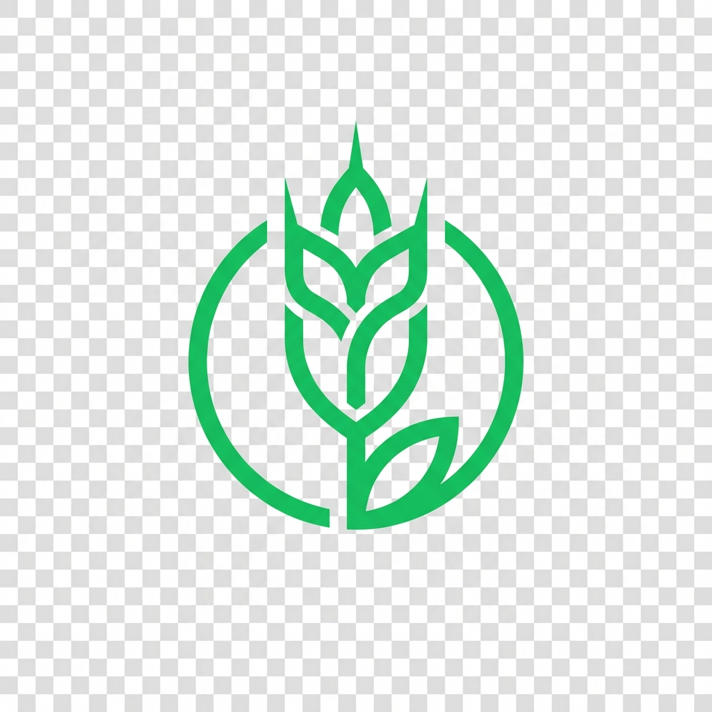
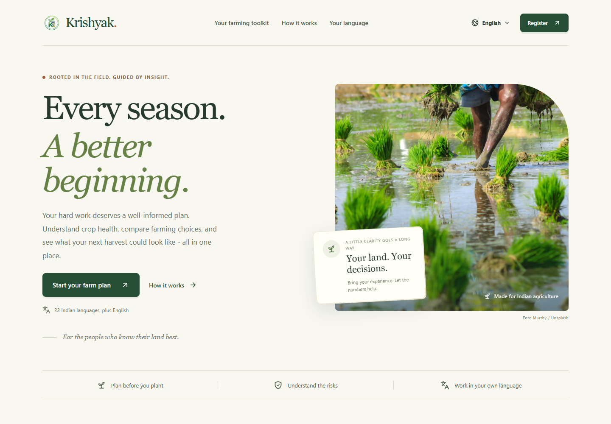
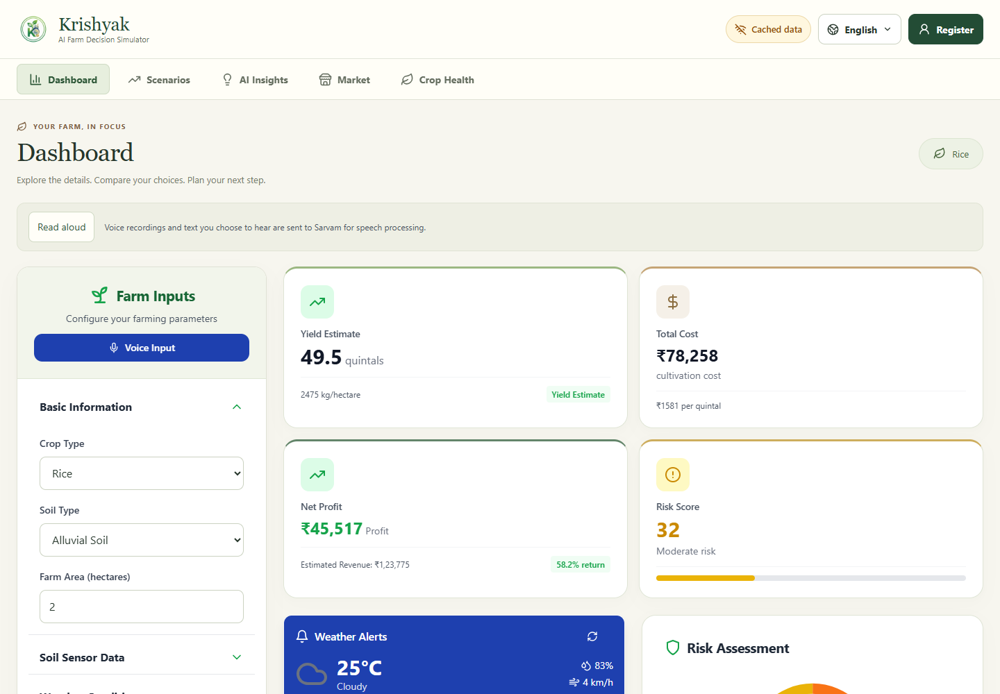
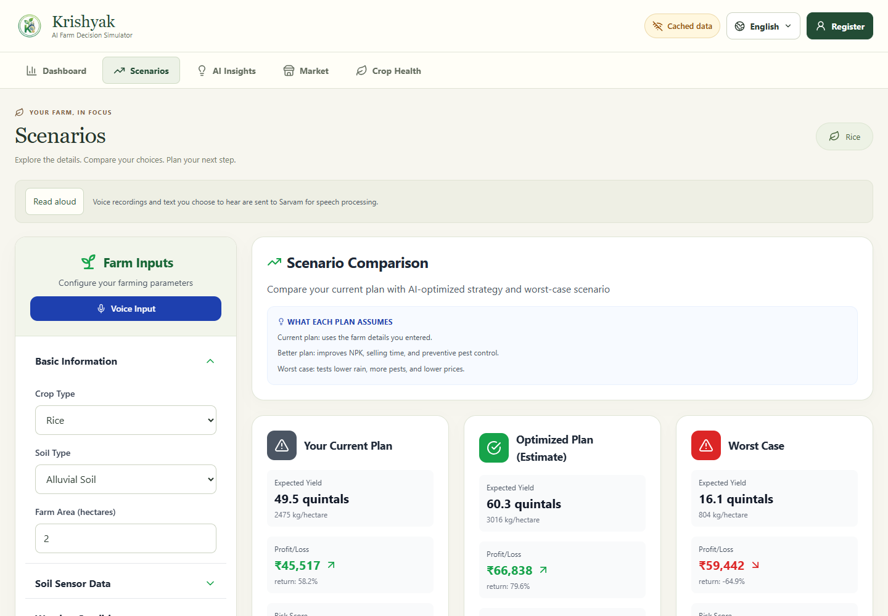
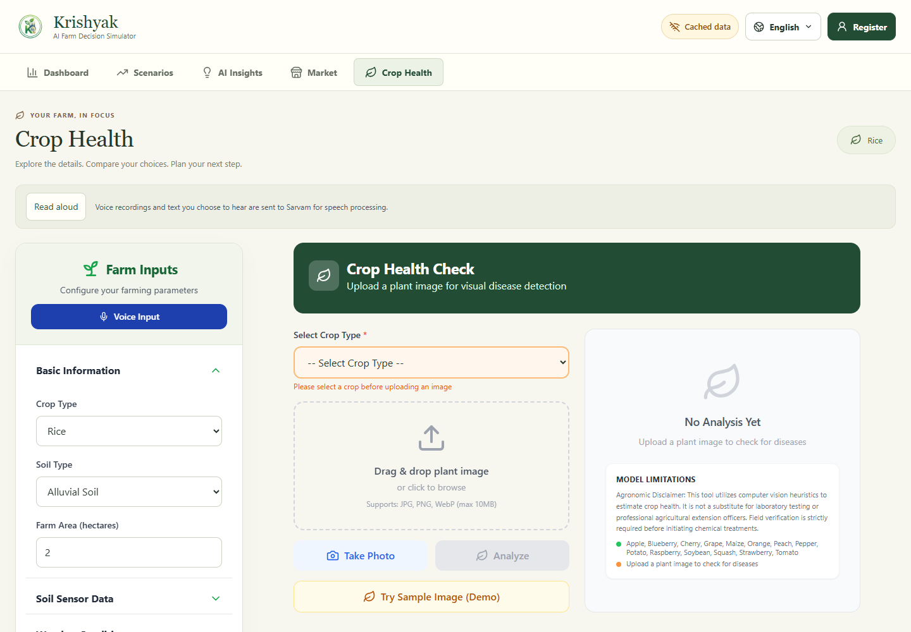
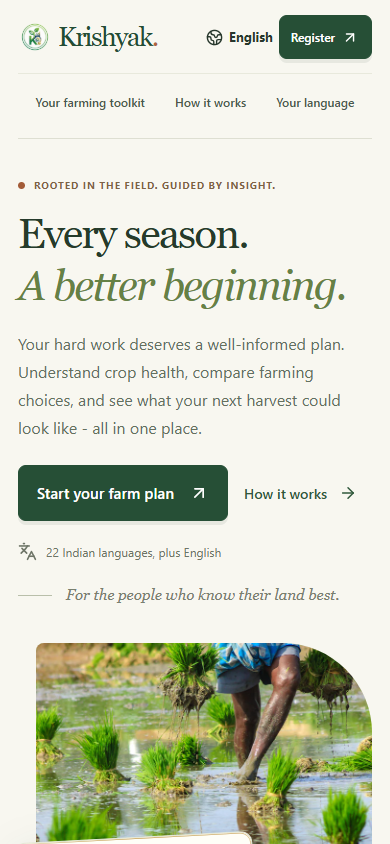
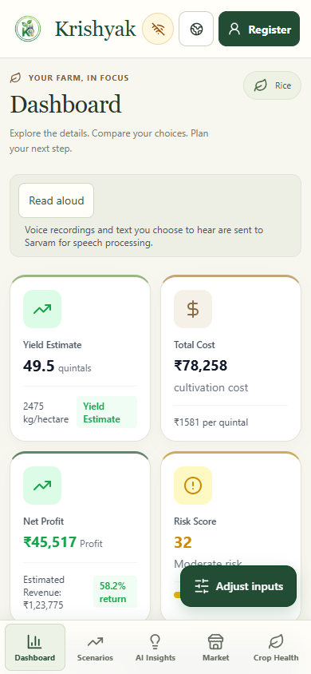

# Krishyak – AI Farm Decision Simulator 🌾

**Empowering Indian farmers with AI-powered decision support for optimal crop planning and profitability**

Development status (30 September 2026): the user-selected default disease model is the recovered 38-class EfficientNetV2B0 Colab bundle (94.39% validation, 93.71% internal test). The recorded external PlantDoc result remains 57.21%; selection does not change that evaluation. See [active model metadata](backend/models/active/release.json) and [the audit](REPOSITORY_AUDIT.md). Yield and risk calculations remain heuristic estimates; superiority over NPSS is not established.

<p align="center">
  
</p>

<p align="center">
  <a href="https://krishyak.vercel.app/">🌐 Live Demo</a> •
  <a href="#-quick-start">🚀 Quick Start</a> •
  <a href="#-key-features">✨ Features</a> •
  <a href="#-api-endpoints">📡 API</a>
</p>

---

## 🌾 Overview

Krishyak (कृष्यक - "The Cultivator") is a comprehensive full-stack web application that helps Indian farmers make data-driven decisions about crop planning, cultivation strategies, and market timing. The system uses advanced simulation engines, machine learning models, and real-time data to provide actionable insights.

## ✨ Key Features

| Feature | Description |
|---------|-------------|
| 🎯 **AI Yield Estimation** | Multi-factor yield prediction based on soil, rainfall, irrigation, fertilizer, and pest risks |
| 💰 **Fertilizer Analyzer** | Crop-specific NPK recommendations with organic alternatives and dosage schedules |
| ⚠️ **Risk Assessment** | Circular gauge with intelligent risk scoring (weather, price, pest, soil factors) |
| 📈 **Price Forecasting** | Historical-price context and a transparent persistence baseline; sale-timing optimization requires validation |
| 🔄 **What-If Simulation** | Monte Carlo simulations (100-2000 scenarios) to compare farming strategies |
| 🌍 **22 Indian Languages + English** | Static Sarvam-generated UI translations; language changes make no translation API calls. Machine translations still need native-language review. |
| 🎤 **Voice Input & Read-aloud** | Sarvam Saaras STT for 23 languages; Bulbul TTS for 11 supported languages, with server-side quotas and cached audio. |
| 📍 **Location Auto-Fill** | Automatic soil type and rainfall detection via geolocation |
| 🏛️ **Government Schemes** | Smart eligibility matcher for PM-KISAN, PMFBY, KCC and 8+ schemes with required documents |
| 🌿 **Disease Detection** | Local image classifier with explicit unsupported, uncertain, healthy and unavailable outcomes |
| 📱 **Mobile-First UX** | Fully stabilized Android-first responsive architecture with Bottom Sheet, touch-safe FABs, & compact data views |
| 🧪 **Soil Sensor Integration** | Manual soil data entry with NPK, pH, moisture, temperature tracking |

## 📸 Screenshots

Updated UI captured locally on 30 September 2026. Dashboard values are illustrative simulation results, not measured harvest outcomes. The live deployment may differ until its deployment completes.

### Farmer-focused landing page
Farm photography, an overview of the tools, language selection and a Register button leading to the existing form.


### Farm planning dashboard
Yield, cultivation cost, profit, ROI and risk estimates alongside the complete farm-input panel. Cached results are explicitly labeled when applicable.


### Scenario comparison
Current, optimized and worst-case plans with assumptions, costs, outcomes and suggested input changes.


### Crop health and disease detection
Image upload and supported-crop guidance for the selected 38-class model.


### Mobile landing and farm analysis
Responsive layouts, labeled farm-input controls and persistent analysis navigation.
<p>
  
  
</p>

---

## 🏗️ Technology Stack

### Backend
- **Framework**: FastAPI (Python 3.12)
- **ML/AI**: TensorFlow, Keras (EfficientNetV2B0; 38 crop/condition classes)
- **Simulation**: Monte Carlo sensitivity analysis and persistence price baseline

### Frontend
- **Framework**: React 18
- **Styling**: TailwindCSS
- **Charts**: Recharts
- **Voice**: Browser microphone recording → backend Sarvam Saaras v3 STT; Sarvam Bulbul v3 TTS → browser audio playback

## 📁 Project Structure

```
krishyak/
├── backend/
│   ├── main.py                 # FastAPI application
│   ├── simulation_engine.py    # Monte Carlo simulator
│   ├── disease_detector.py     # Multi-source disease detection
│   ├── train_model.py          # ML model training pipeline
│   ├── model_inference.py      # Disease prediction
│   ├── config.py               # 50+ crops, MSP 2025 rates
│   └── requirements.txt
├── frontend/
│   ├── src/
│   │   ├── components/         # React components
│   │   ├── hooks/              # Custom hooks (voice, etc.)
│   │   ├── api/                # API clients
│   │   └── data/               # Static data (schemes, diseases)
│   └── package.json
└── screenshots/                # UI screenshots
```

## 🚀 Quick Start

### Prerequisites
- Python 3.12
- Node.js 22.13+ on the 22.x line, or Node.js 24+ (frontend build and lint)
- npm or yarn

### Backend Setup

```bash
cd backend
python -m venv venv
venv\Scripts\activate        # Windows
# source venv/bin/activate   # Linux/Mac
pip install -r requirements.txt
python main.py
```
- API: `http://localhost:8000`
- Docs: `http://localhost:8000/docs`

### Frontend Setup

```bash
cd frontend
npm ci
npm start
```
- App: `http://localhost:3000`

Frontend verification: `npm run lint`, `npm test -- --runInBand` and `npm run build`. The build runs lint first.
Vite writes production files to `frontend/build`; `npm run preview` serves that build locally.
The existing `REACT_APP_API_URL` deployment variable remains supported. Only that explicit variable is exposed to the browser.

### Environment Variables (Optional)

```bash
# backend/.env - never put these keys in frontend variables
OPENWEATHER_API_KEY=your_key_here
SARVAM_API_KEY=your_sarvam_key
```

### Active disease model

The default loader uses `backend/models/active/model.keras` and the matching `class_indices.json`; the original model is retained separately. `release.json` identifies the selected model and preserves evaluation metrics. `KRISHYAK_DISEASE_BUNDLE` can override the entire bundle. A backend restart is required after changing bundles. A classifier score is not calibrated diagnostic accuracy.

The verified active model is included in Git alongside its labels (SHA-256 `5d8b08e61feae381a7bf05f0dea8fe77527e0dcc2dd7b5714f5160eb5341a591`). `backend/requirements.txt` includes the CPU inference runtime. Deploy the backend as a separate Vercel project rooted at `backend`, with Fluid compute and `VERCEL_SUPPORT_LARGE_FUNCTIONS=1` enabled for the TensorFlow package. Set `SARVAM_API_KEY` in that backend project's production environment; a local `.env` does not configure Vercel. The frontend defaults to `https://krishyak-api.vercel.app`, or accepts `REACT_APP_API_URL` for another backend. Verify `/disease-capabilities` and `/speech/capabilities` after deployment. Voice Input is accessible from the workspace toolbar on desktop and mobile.

### Sarvam translation and speech

Set `SARVAM_API_KEY` in `backend/.env` or the backend host environment. The key never enters browser bundles. Generate static translations once from the repository root:

```powershell
.\backend\venv\Scripts\python.exe backend/generate_sarvam_locales.py
.\backend\venv\Scripts\python.exe backend/verify_sarvam_locales.py
```

The generator translates all English locale strings into 22 languages with `sarvam-translate:v1`, validates interpolation placeholders, and publishes separate locale files under `frontend/src/i18n/locales/sarvam`. It checkpoints by source text/model/language in `.codex-tmp/sarvam-translations`; retain this cache when regenerating so unchanged strings are not billed again. Only changed strings require new translations. Commit the generated packs and rebuild the frontend. No translation endpoint runs when someone opens a page or changes language. API-delivered information still uses the existing localized UI summaries; arbitrary new server text is not silently translated.

Voice input records at most 29 seconds per interaction, sends audio to the backend `/speech/transcribe` endpoint and lets the farmer review/correct the result. It requires microphone permission and HTTPS (or localhost). Read-aloud uses `/speech/synthesize`; repeated identical text/language/pace reuses a bounded backend audio cache. New speech requests incur Sarvam usage. Audio/transcripts are sent to Sarvam to provide the requested feature, but this backend does not persist them to disk.

Translation and STT cover all 22 scheduled Indian languages plus English. **Sarvam Bulbul v3 TTS currently covers English, Hindi, Bengali, Gujarati, Kannada, Malayalam, Marathi, Odia, Punjabi, Tamil and Telugu.** Read-aloud is unavailable for the remaining languages; no silent switch to another language/provider occurs. See [Sarvam translation](https://docs.sarvam.ai/api-reference/text/translate-text), [STT](https://docs.sarvam.ai/api-reference/speech-to-text/transcribe), and [TTS](https://docs.sarvam.ai/api-reference/text-to-speech/convert) documentation.

Speech abuse controls default to 6 requests/IP/minute, 60/IP/day, 20 global/minute, 300 global/day, 200,000 TTS characters/day and 3 concurrent provider calls. Uploads are bounded before multipart parsing; audio is limited to 6 MB and TTS requests to 2,500 characters. Errors do not expose provider response bodies or credentials. Failed attempts and cached responses conservatively count against local quotas. Quotas fail closed if storage is unavailable.

Configure `SARVAM_IP_PER_MINUTE`, `SARVAM_IP_PER_DAY`, `SARVAM_GLOBAL_PER_MINUTE`, `SARVAM_GLOBAL_PER_DAY`, `SARVAM_TTS_CHARACTERS_PER_DAY`, `SARVAM_MAX_CONCURRENT` and `SARVAM_QUOTA_DB` as needed. SQLite counters survive restarts on durable storage and coordinate workers sharing that file. In-memory concurrency/audio cache are per process. Multiple replicas/serverless temporary files do **not** share a global quota: use a shared gateway limiter and a provider account spending cap for deployment-wide protection. Leave `TRUST_PROXY_HEADERS=false` unless the hosting gateway reliably overwrites forwarded client headers. Existing general API rate limits also apply.

Default speech limits are 6 requests/minute and 60/day per client, 20/minute and 300/day per quota store, 200,000 TTS characters/day per store, and 3 concurrent provider calls per process. Requests are bounded to 2,500 TTS characters or 30 seconds of validated WAV audio. Quota storage failures block paid requests. The API key belongs only in the backend environment, never frontend variables or Git. An additional Vercel firewall rule for `POST /speech/*` at 30 requests/minute/IP has been staged in log-only mode; it is not an active blocking rule until reviewed, switched to enforcement, and published in Vercel.

## 📡 API Endpoints

| Endpoint | Method | Description |
|----------|--------|-------------|
| `/simulate` | POST | Run farming simulation |
| `/forecast_prices` | POST | Forecast commodity prices |
| `/compare_scenarios` | POST | Compare farming strategies |
| `/recommend` | POST | Get AI recommendations |
| `/detect_disease` | POST | AI disease detection from image |
| `/crops` | GET | List of 50+ supported crops |
| `/soils` | GET | List of soil types |
| `/diseases` | GET | Disease database |
| `/speech/capabilities` | GET | Configured Sarvam STT/TTS language coverage |
| `/speech/transcribe` | POST | Quota-limited audio transcription |
| `/speech/synthesize` | POST | Quota-limited, cached read-aloud audio |

## 🌾 Farm Planning Crops (50+)

- **Cereals**: Rice, Wheat, Maize, Barley, Bajra, Jowar, Ragi
- **Pulses**: Tur, Gram, Urad, Moong, Lentil, Chickpea
- **Vegetables**: Potato, Onion, Tomato, Brinjal, Cabbage, Cauliflower, Okra, Carrot, Spinach, Chilli
- **Fruits**: Mango, Banana, Grapes, Pomegranate, Orange, Guava, Papaya, Apple, Watermelon
- **Oilseeds**: Groundnut, Soybean, Sunflower, Mustard, Cotton, Sugarcane
- **Spices**: Turmeric, Cumin, Fenugreek, Black Pepper, Cardamom

## 🎤 Voice Commands (23 transcription languages)

Select the interface language, record, stop, then review/correct the extracted farm inputs before applying them. The parser is rule-based; transcription support does not guarantee that every spoken instruction is parsed. Hindi and English examples:

```
"दो हेक्टेयर धान की खेती"    → Rice, 2 hectares
"living in Nashik"            → Location: Nashik
"बारिश 800 mm"                 → Rainfall: 800mm
"काली मिट्टी"                   → Soil: Black
"अच्छा बीज"                     → Seed quality: Good
```

## 🌿 Disease Detection

The active classifier is **EfficientNetV2B0**, with 38 crop/condition classes across 14 crops: apple, blueberry, cherry, maize, grape, orange, peach, pepper, potato, raspberry, soybean, squash, strawberry and tomato. Some crops have only a healthy class; class coverage is not a comprehensive disease catalog.

- Validation accuracy: **94.39%**; internal test accuracy: **93.71%**.
- Recorded external PlantDoc test accuracy: **57.21%**. These datasets measure different evaluation conditions; internal scores do not establish field performance.
- The interface preserves healthy, detected, uncertain, unsupported and unavailable outcomes. Low-confidence results do not fabricate a diagnosis or treatment.
- The planning crop catalog is broader than the classifier's supported crops. Pattern/keyword lookup is not used as a substitute image diagnosis.
- See the active bundle instructions above for model provisioning on a new host.

## 🏛️ Government Schemes (Updated Dec 2025)

| Scheme | Benefit |
|--------|---------|
| PM-KISAN | ₹6,000/year (21st installment Nov 2025) |
| PMFBY | Crop Insurance (1.5-2% premium) |
| MSP 2025-26 | Rice ₹2,369, Wheat ₹2,425/quintal |
| Kisan Credit Card | 4% interest up to ₹3 lakh |
| Micro Irrigation | 45-55% subsidy |

## 🧮 Simulation Models

### Yield Estimation
```
Final Yield = Base Yield × Soil × Rainfall × Irrigation × Fertilizer × Seed × Pest Factor
```

### Risk Score (0-100)
```
Composite Risk = Weather(30%) + Price Volatility(25%) + Pest Severity(25%) + Soil Mismatch(20%)
Final Risk = min(100, Composite Risk + (1 - Yield Confidence) × 10)
```

## 🎯 Use Cases

1. **Pre-Season Planning** - Compare crop choices with simulations
2. **Resource Optimization** - Optimal fertilizer and irrigation mix
3. **Risk Mitigation** - Weather and market risk analysis
4. **Market Timing** - Best selling window identification
5. **Disease Management** - Early detection and treatment recommendations
6. **Scheme Eligibility** - Check government benefits

## ✅ Latest Updates (September 2026)

- **New landing page** with farm photography, toolkit explanations, FAQs and registration/guest entry. Existing sessions continue to the workspace.
- **Farmer-focused UI refresh** with warm surfaces, readable typography, touch-friendly controls, responsive cards and reduced-motion support. Existing metrics, charts, inputs and analysis workflows remain available.
- **Sarvam integration** for cached static translations, STT and supported-language TTS, with server-side request/character quotas and upload limits. All 22 translated packs contain 981 strings; unchanged regeneration uses zero provider requests.
- **Selected Colab model** installed as the default bundle, with version and evaluation metadata retained.
- **Verification**: 149 backend tests and 219 frontend tests passed; frontend lint, production build and translation validation passed during local verification. A nonfatal large-bundle warning remains.
- **Asset attribution**: photograph and Magic UI/21st.dev component sources and licenses are documented in [third-party notices](frontend/THIRD_PARTY_NOTICES.md).

## ✅ Previous UI Updates (April 2026)

- [x] **Mobile-First Redesign** - Comprehensive UI overhaul for touch-friendly mobile navigation with floating actions, bottom sheets, and responsive grids.
- [x] **Enhanced Farmer Registration** - Streamlined onboarding flow with real-time validation.
- [x] **Improved App Stability** - Fixed component rendering bugs and state management optimizations across the dashboard.
- [x] **Styling Fixes** - Corrected layout overflows, optimized spacing, and refined typography for modern mobile displays.

## ✅ April 2026 Resilience & Trust Updates (Final Polish)

- [x] **Scenario Logic Hardening** - Worst-case simulations now accurately model economic/climatic crises (input sinks paired with yield crashes).
- [x] **Truth-First AI Insights** - Replaced opaque "AI" buzzwords with explicit heuristic, simulation, or statistical descriptors. 
- [x] **Pest Intelligence Relevancy** - Fully patched case-sensitive cross-crop contamination, ensuring strict crop-aware alerts and honest empty states.
- [x] **UX Stability** - Patched loading states falling into 100% frozen cycles, preserving user-friendly flow.

## ✅ Previous Updates (January 2026)

- [x] **13 Indian Languages** - Full i18n with Hindi, Tamil, Telugu, Bengali, Marathi, Gujarati, Kannada, Malayalam, Punjabi, Assamese, Odia, Urdu (RTL)
- [x] **Fertilizer Analyzer Engine** - Crop-specific NPK recommendations with organic alternatives and dosage schedules
- [x] **Government Scheme Matcher** - Smart eligibility checker with expandable document requirements
- [x] **Soil Sensor Integration** - Manual NPK/pH/moisture data entry with React Portal modal
- [x] **55+ Crop Translations** - Complete translations for all crops in all languages
- [x] Multi-source AI disease detection
- [x] 50+ crops with MSP 2025-26 rates
- [x] Voice input in Hindi & English
- [x] Location-based soil detection
- [x] Circular risk gauge visualization

## 📝 License

This project is built for educational and social impact purposes.

## 👥 Contributors

Built with ❤️ for Indian farmers

---

<p align="center">
  <strong>Krishyak (कृष्यक) – Made with 🌾 for sustainable and profitable farming</strong>
</p>
