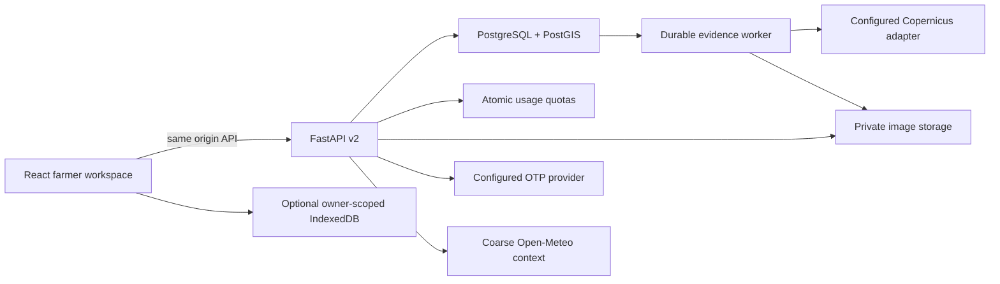

# Architecture

The v2 workspace persists field evidence in a modular FastAPI monolith. A separate
worker processes durable jobs and retention. This is decision support, not
autonomous farm control. Public scenario planning remains under `/planning`.

`backend/db` defines persistence; `repositories/ownership.py` scopes resources;
`v2/auth.py` owns session security; routers own validation and transactions.
`v2/providers.py` contains OTP/object-storage interfaces. Existing
`remote_sensing/providers/base.py` defines the satellite provider boundary.
Government adapters explicitly distinguish public information from authorized access.

Today composes stored provenance and conservative rules. It does not call a
generative model, infer disease from vegetation indices, adjust economic returns
with satellite data, or assign a universal health score. Image inference uses the
active release metadata, not a newly promoted checkpoint.

Deployed accounts require TLS database/Redis, private S3-compatible storage,
configured OTP and a running worker. A static frontend or sleeping free API alone
cannot supply those guarantees. See [deployment](DEPLOYMENT.md) and
[limitations](KNOWN_LIMITATIONS.md).
